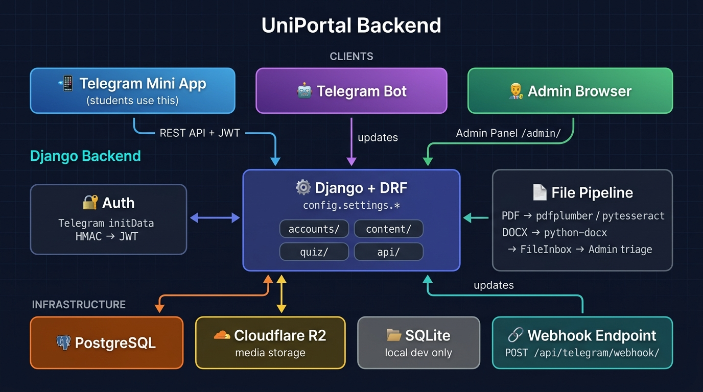

# UniPortal Backend

> Django + DRF backend powering the **Unity University Telegram Mini App**.  
> Students access study materials, practice quizzes, and exit exam prep through a Telegram Mini App. This backend handles all data, file processing, authentication, and the Telegram bot.

---

## Tech Stack

| Layer | Technology |
|---|---|
| Framework | Django 6 + Django REST Framework |
| Database | PostgreSQL (SQLite for local dev) |
| File Storage | Local filesystem (dev) → Cloudflare R2 (production) |
| File Processing | pdfplumber, pytesseract, python-docx |
| Telegram Bot | python-telegram-bot |
| Admin Panel | Django Admin + django-unfold |
| Auth | Telegram initData HMAC validation (JWT tokens) |

---

## 🗺️ System Architecture




## 🚀 Running Locally

### Prerequisites


- Python 3.12+ (required by Django 6)
- `pip`
- SQLite is the default for local development; PostgreSQL is optional.

---

### 1. Clone & enter the project

```bash
git clone <repo-url>
cd uniportal-backend
```

### 2. Create & activate a virtual environment

```bash
python -m venv venv
source venv/bin/activate        # Linux / macOS
# venv\Scripts\activate         # Windows
```

### 3. Install dependencies

```bash
pip install -r requirements.txt
```

### 4. Set up environment variables

```bash
cp -n .env.example .env  # preserve an existing .env
```

Then open `.env` and update the following key values for local development:

```env
DEBUG=True
DJANGO_SETTINGS_MODULE=config.settings.dev
SECRET_KEY=any-local-secret-key-here

# Use SQLite locally (no PostgreSQL needed)
# Leave DATABASE_URL unset — base.py falls back to SQLite.
# DB_* variables are used by Docker settings, not local dev settings.

# Telegram (optional for local API testing without the bot)
TELEGRAM_BOT_TOKEN=your-bot-token
```

### 5. Apply database migrations

```bash
python manage.py migrate
```

### 6. Create a superuser (for the admin panel)

```bash
python manage.py createsuperuser
```

### 7. Start the development server

```bash
python manage.py runserver
```

The API will be available at: **http://127.0.0.1:8000/**  
Admin panel: **http://127.0.0.1:8000/admin/**  
API docs (Swagger): **http://127.0.0.1:8000/api/docs/**  
Health check: **http://127.0.0.1:8000/health/**

The root URL (`/`) has no page and returns 404. This repository contains the
backend and admin panel; the Telegram Mini App frontend runs separately.
Student API authentication requires valid Telegram initData and a real bot
token. You can use the admin login and health check without running the bot.

If `venv/` and `.env` are already configured, start with:

```bash
source venv/bin/activate
python manage.py migrate --settings=config.settings.dev
python manage.py runserver 127.0.0.1:8000 --settings=config.settings.dev
```

---

### 8. (Optional) Run the Telegram bot

Open a **second terminal**, activate the venv, then:

```bash
python manage.py run_bot
```

> The bot and the Django server run as separate processes. In production, both are managed by the `Procfile`.

---

## 🐳 Running with Docker

Docker Compose spins up **3 services** defined in [`docker-compose.yml`](docker-compose.yml):

| Service | Container | Description |
|---|---|---|
| `postgres` | `uniportal-postgres` | PostgreSQL 15 database |
| `django` | `uniportal-backend` | Gunicorn (runs migrations + static files on start) |
| `bot` | `uniportal-bot` | Telegram bot (`maintenance` profile — opt-in only) |

> **Note:** The `bot` service uses the `maintenance` Docker profile, so it does **not** start automatically with `docker-compose up`. You have to enable it explicitly (see below).

---

### Prerequisites

- Docker & Docker Compose installed

---

### 1. Set up environment variables

```bash
cp .env.example .env
```

Key values to set for Docker:

```env
DJANGO_SETTINGS_MODULE=config.settings.docker   # already set in compose
DEBUG=False
SECRET_KEY=your-secret-key
DB_PASSWORD=your-db-password
TELEGRAM_BOT_TOKEN=your-bot-token
USE_S3=False                                     # use local media volume
```

### 2. Build and start the main services

```bash
docker-compose up --build
```

Or run in detached (background) mode:

```bash
docker-compose up --build -d
```

- **API**: http://localhost:8000/
- **Admin panel**: http://localhost:8000/admin/

### 3. (Optional) Also start the Telegram bot

The bot service uses the `maintenance` profile and must be started explicitly:

```bash
docker-compose --profile maintenance up
```

Or to add the bot alongside the main services:

```bash
docker-compose --profile maintenance up --build -d
```

---

### Useful Docker Commands

```bash
# View running containers
docker-compose ps

# View live logs from all services
docker-compose logs -f

# View logs from a specific service
docker-compose logs -f django
docker-compose logs -f bot

# Run a Django management command inside the container
docker-compose exec django python manage.py createsuperuser
docker-compose exec django python manage.py migrate
docker-compose exec django python manage.py shell

# Stop all services
docker-compose down

# Stop and remove volumes (resets the database!)
docker-compose down -v
```

---

## Project Structure

```
uniportal-backend/
├── config/                  ← Django project settings
│   └── settings/
│       ├── base.py          ← Shared settings
│       ├── dev.py           ← Local development overrides
│       ├── docker.py        ← Docker / staging settings
│       └── prod.py          ← Production settings
├── apps/
│   ├── accounts/            ← Student profiles, Telegram auth
│   ├── content/             ← Departments, courses, resources
│   ├── quiz/                ← Questions, attempts, scoring
│   ├── bot/                 ← Telegram bot & file harvesting
│   └── api/                 ← All DRF endpoints
├── manage.py
├── requirements.txt
├── Procfile                 ← Production process definitions
├── docker-compose.yml
└── .env.example             ← Environment variable template
```

---

## Useful Management Commands

| Command | Description |
|---|---|
| `python manage.py runserver` | Start local dev server |
| `python manage.py migrate` | Apply database migrations |
| `python manage.py makemigrations` | Create new migrations |
| `python manage.py createsuperuser` | Create admin user |
| `python manage.py run_bot` | Start the Telegram bot process |
| `python manage.py shell` | Open Django interactive shell |

---

## Environment Variables Reference

See [`.env.example`](.env.example) for the full list. Key variables:

| Variable | Description |
|---|---|
| `SECRET_KEY` | Django secret key |
| `DEBUG` | `True` for local dev |
| `DJANGO_SETTINGS_MODULE` | Use `config.settings.dev` locally |
| `TELEGRAM_BOT_TOKEN` | From @BotFather |
| `TELEGRAM_CHANNEL_ID` | Channel the bot monitors |
| `GROQ_API_KEY` / `GEMINI_API_KEY` | AI APIs for question extraction |
| `DB_*` | PostgreSQL connection (not needed for SQLite) |
| `USE_S3` / `R2_*` | Cloudflare R2 storage (set `USE_S3=False` locally) |
