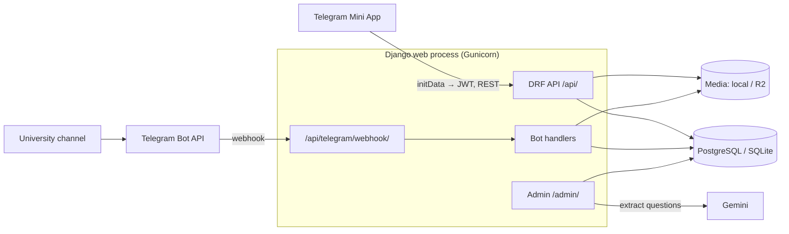

# UniPortal Backend

> Django + DRF backend powering the **Unity University Telegram Mini App**.
> Students access study materials, practice quizzes, exit exam prep, and their
> exam schedule through a Telegram Mini App. This backend handles all data,
> file processing, authentication, payments, and the Telegram bot.

---

## Tech Stack

| Layer | Technology |
|---|---|
| Framework | Django 6 + Django REST Framework |
| Database | PostgreSQL (SQLite for local dev) |
| File Storage | Local filesystem (dev) → Cloudflare R2 (production) |
| File Processing | pdfplumber, pytesseract (OCR), python-docx |
| AI | Google Gemini (question extraction from documents) |
| Telegram Bot | python-telegram-bot (webhook mode) |
| Admin Panel | Django Admin + django-unfold |
| Auth | Telegram initData HMAC validation → JWT |
| API Docs | drf-spectacular (Swagger / ReDoc) |

---

## 🗺️ Architecture



- **One web process** serves the API, the admin, and the Telegram webhook.
- **Bot updates arrive by webhook**; `run_bot` only recovers stuck inbox items.
- **Content pipeline:** channel file → `FileInbox` → text extraction → admin
  publishes a `Resource` and/or extracts quiz questions with Gemini.

See **[docs/ARCHITECTURE.md](docs/ARCHITECTURE.md)** for the full design:
apps and models, auth, downloads, quiz scoring, subscriptions, exam lookup,
the API surface, and operational commands.

---

## 🚀 Running Locally

### Prerequisites

- Python **3.12+** (required by Django 6)
- `pip` and `venv`
- Optional, only needed for OCR on scanned PDFs/images:
  `tesseract-ocr` and `poppler-utils`
  ```bash
  sudo apt install tesseract-ocr poppler-utils   # Debian / Ubuntu / WSL
  brew install tesseract poppler                 # macOS
  ```

SQLite is used by default, so no database server is needed.

### Quick start

```bash
# 1. Clone
git clone <repo-url>
cd uniportal-backend

# 2. Virtual environment
python3 -m venv venv
source venv/bin/activate          # Windows: venv\Scripts\activate

# 3. Dependencies
pip install -r requirements.txt

# 4. Environment file (won't overwrite an existing .env)
cp -n .env.example .env
```

Edit `.env` — the minimum for local development:

```env
DEBUG=True
SECRET_KEY=any-local-secret-key-here
# Leave DATABASE_URL unset → SQLite (db.sqlite3). DB_* values are only used by Docker.
# Optional — only needed for real Telegram auth / bot features:
TELEGRAM_BOT_TOKEN=your-bot-token
# Optional — only needed for AI question extraction in the admin:
GEMINI_API_KEY=your-gemini-key
```

> `manage.py` defaults to `config.settings.dev`, so the
> `DJANGO_SETTINGS_MODULE` line in `.env` does not affect local commands.

```bash
# 5. Database
python manage.py migrate

# 6. (Optional) Seed departments, courses, plans and site settings
python manage.py seed_data

# 7. Admin user
python manage.py createsuperuser

# 8. Run
python manage.py runserver
```

| URL | What |
|---|---|
| http://127.0.0.1:8000/admin/ | Admin panel |
| http://127.0.0.1:8000/api/docs/ | Swagger API docs |
| http://127.0.0.1:8000/api/redoc/ | ReDoc API docs |
| http://127.0.0.1:8000/health/ | Health check |

The root URL (`/`) has no page and returns 404. The Mini App frontend lives in
a separate repository.

### Daily workflow

Once `venv/` and `.env` exist:

```bash
source venv/bin/activate
python manage.py migrate
python manage.py runserver
```

### Calling the API without Telegram

In `DEBUG` mode you can get a JWT without real Telegram initData:

```bash
curl -s -X POST http://127.0.0.1:8000/api/auth/telegram/ \
  -H "Content-Type: application/json" \
  -d '{"dev_mode": true, "telegram_id": 999999, "first_name": "Dev"}'
```

Use the returned token on other endpoints:

```bash
TOKEN=<token from above>
curl -s http://127.0.0.1:8000/api/students/me/ -H "Authorization: Bearer $TOKEN"
curl -s http://127.0.0.1:8000/api/departments/ -H "Authorization: Bearer $TOKEN"
```

### Testing the Telegram bot locally (optional)

The bot runs in **webhook mode**, so Telegram must be able to reach your
machine. Expose the dev server with a tunnel (e.g. `ngrok http 8000` or
`cloudflared tunnel --url http://localhost:8000`), then:

```env
# .env
TELEGRAM_BOT_TOKEN=your-test-bot-token
TELEGRAM_WEBHOOK_URL=https://<your-tunnel-host>/api/telegram/webhook/
TELEGRAM_WEBHOOK_SECRET=any-random-string
```

```bash
# Add the tunnel host to ALLOWED_HOSTS in config/settings/dev.py if needed
python manage.py runserver
python manage.py setup_webhook          # register the webhook
python manage.py setup_webhook --delete # remove it when done
```

> Use a separate test bot — registering a webhook replaces the one set for
> production on the same bot token.

### Running tests

```bash
python manage.py test --settings=config.settings.test                  # all apps
python manage.py test apps.quiz --settings=config.settings.test        # one app
python manage.py check --settings=config.settings.test
python manage.py makemigrations --check --dry-run --settings=config.settings.test
```

Test settings use isolated temporary media, in-memory SQLite by default, and no
real external-service credentials. Set `DATABASE_URL` to a disposable PostgreSQL
database to run against PostgreSQL. CI runs both databases and a synthetic backup
restore check. See [Phase 1 baseline](docs/PHASE_1_BASELINE.md) for verification,
Railway measurements, and backup procedures.

The app is in a **free adoption period**. Paid access enforcement is deferred.
Some legacy premium gates remain in the backend; their inventory is documented
in the baseline. The phased plan is in [improvemnts.md](improvemnts.md).
Phase 2 quiz/payment changes, simulation headers, migrations, and rollout checks
are documented in [Phase 2 correctness](docs/PHASE_2_CORRECTNESS.md).

---

## 🐳 Running with Docker

Docker Compose defines **3 services** in [`docker-compose.yml`](docker-compose.yml):

| Service | Container | Description |
|---|---|---|
| `postgres` | `uniportal-postgres` | PostgreSQL 15 database |
| `django` | `uniportal-backend` | Gunicorn on port 8000; runs migrations and `collectstatic` on start |
| `bot` | `uniportal-bot` | Runs `run_bot` (inbox recovery); `maintenance` profile, opt-in only |

```bash
cp -n .env.example .env        # set SECRET_KEY, DB_PASSWORD, TELEGRAM_BOT_TOKEN
docker compose up --build -d   # postgres + django
docker compose --profile maintenance up -d bot   # optional: inbox recovery
```

API and admin: http://localhost:8000/ and http://localhost:8000/admin/

Useful commands:

```bash
docker compose ps
docker compose logs -f django
docker compose exec django python manage.py createsuperuser
docker compose exec django python manage.py seed_data
docker compose exec django python manage.py shell
docker compose down        # stop
docker compose down -v     # stop and DELETE the database volume
```

---

## Project Structure

```
uniportal-backend/
├── config/
│   ├── settings/
│   │   ├── base.py          ← Shared settings (reads .env)
│   │   ├── dev.py           ← Local development (manage.py default)
│   │   ├── docker.py        ← Docker / staging
│   │   └── prod.py          ← Production
│   └── urls.py              ← /admin/, /api/, /api/docs/, /health/
├── apps/
│   ├── accounts/            ← Students, subscriptions, payments, broadcasts
│   ├── content/             ← Departments, courses, resources, file inbox
│   ├── quiz/                ← Questions, exam papers, chapters, scoring engine
│   ├── exams/               ← Exam schedule PDFs → student exam lookup
│   ├── bot/                 ← Telegram handlers, file harvesting, OCR, Gemini
│   └── api/                 ← DRF views, auth middleware, permissions
├── docs/
│   └── ARCHITECTURE.md      ← System design
├── templates/               ← Admin template overrides
├── Dockerfile / docker-compose.yml
├── Procfile                 ← web (Gunicorn) + worker (run_bot) processes
└── .env.example             ← Environment variable template
```

---

## Management Commands

| Command | Description |
|---|---|
| `runserver` / `migrate` / `createsuperuser` / `shell` | Standard Django |
| `seed_data` | Seed departments, courses, plans, site settings |
| `setup_webhook [--delete]` | Register / remove the Telegram webhook |
| `run_bot` | Recover stuck or failed inbox items |
| `harvest_channel` | Back-fill historical channel files into the inbox |
| `check_subscriptions` | Expire lapsed premium subscriptions (schedule daily) |
| `send_exam_notifications` | Send exam countdown messages (schedule daily) |
| `process_exam_pdfs` | Process pending exam schedule/attendance PDFs |
| `import_student_exams` | Import student exam rows from CSV |
| `import_course_with_chapters` / `import_questions_with_chapters` / `import_exit_exam_questions` | Bulk question imports from Excel |

Run any of them with `python manage.py <command> --help` for options.

---

## Environment Variables

See [`.env.example`](.env.example) for the full list.

| Variable | Needed for | Description |
|---|---|---|
| `SECRET_KEY` | always | Django secret key |
| `DEBUG` | always | `True` for local dev |
| `DATABASE_URL` | optional | Database URL; unset → SQLite |
| `DB_*` | Docker | PostgreSQL connection for compose |
| `TELEGRAM_BOT_TOKEN` | auth, bot | From @BotFather; used to verify initData |
| `TELEGRAM_CHANNEL_ID` | bot | Channel the bot harvests files from |
| `TELEGRAM_OFFICIAL_CHANNEL_ID` / `TELEGRAM_CHANNEL_LINK` | auth | Channel students must join; unset → no check |
| `TELEGRAM_ADMIN_CHAT_ID` | payments | Where new subscription requests are announced |
| `TELEGRAM_WEBHOOK_URL` / `TELEGRAM_WEBHOOK_SECRET` | bot | Webhook registration and verification |
| `MINI_APP_URL` | bot | URL opened by the bot's "Open App" button |
| `GEMINI_API_KEY` | admin | AI question extraction |
| `USE_S3` / `R2_*` | production | Cloudflare R2 media storage (`False` locally) |
| `MAX_OCR_FILE_SIZE_MB` | optional | Skip OCR for larger files (default 5) |
