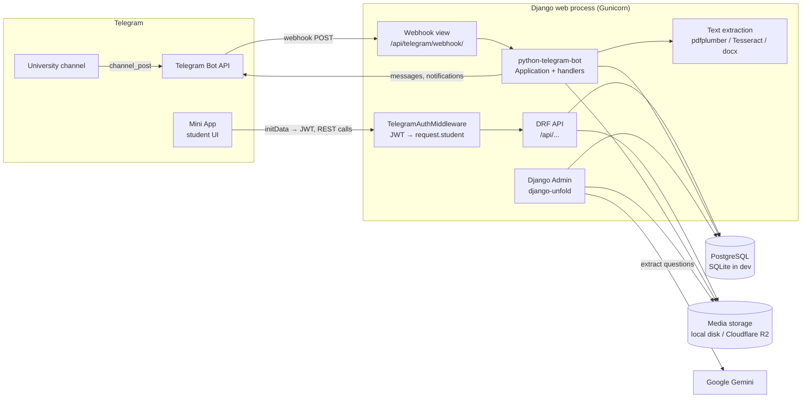
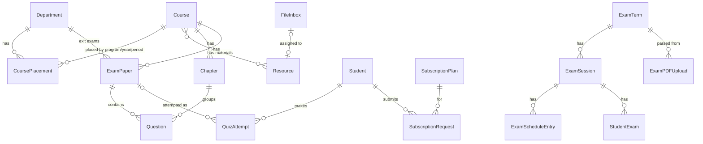
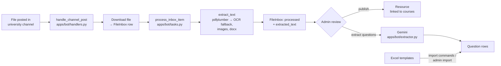
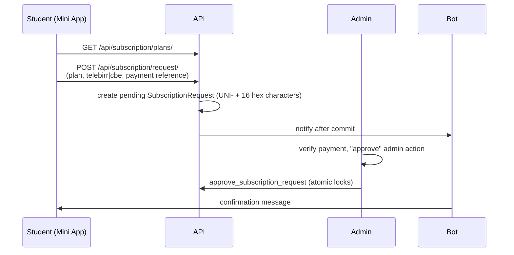

# UniPortal Backend — Architecture

This document describes how the backend is put together today: the
processes that run, the Django apps and their models, and the main request
flows. For setup instructions see the [README](../README.md).

---

## 1. System overview



**Key points**

- **One web process does everything.** Gunicorn serves the REST API, the
  admin, and the Telegram webhook. Bot updates are not polled; Telegram
  POSTs them to `/api/telegram/webhook/`, and `TelegramWebhookView` runs the
  async bot handlers on a dedicated background event loop thread
  (`apps/api/views.py`).
- **The bot Application is built at startup** in `apps/bot/apps.py`
  (`BotConfig.ready`) so the first webhook request is fast. Management
  commands such as `migrate` and `test` skip this.
- **`run_bot` no longer polls.** It only runs inbox recovery (re-processing
  stuck or failed `FileInbox` items). The Procfile `worker` entry and the
  Docker `bot` service (`maintenance` profile) exist for that.
- **No background task queue.** File processing runs inline in the bot
  handler; periodic jobs are management commands meant to be run by cron or
  the hosting platform's scheduler.

---

## 2. Django apps

| App | Responsibility | Main models |
|---|---|---|
| `accounts` | Students, Telegram auth, subscriptions, payments, broadcasts | `Student`, `SubscriptionPlan`, `SubscriptionRequest`, `SiteSettings`, `BroadcastMessage` |
| `content` | Academic catalogue and downloadable materials | `Department`, `Course`, `CoursePlacement`, `Resource`, `FileInbox` |
| `quiz` | Question bank, past papers, scoring | `ExamPaper`, `Chapter`, `Question`, `QuizAttempt`, `QuizSimulation` |
| `exams` | Real exam schedule lookup from university PDFs | `ExamTerm`, `ExamSession`, `ExamScheduleEntry`, `StudentExam`, `ExamPDFUpload`, `ExamNotificationLog` |
| `bot` | Telegram handlers, channel file harvesting, text extraction, AI question extraction | — |
| `api` | All REST endpoints, auth middleware, permissions, throttles | — |

### Data model (simplified)



---

## 3. Request flows

### 3.1 Authentication

```mermaid
sequenceDiagram
    participant MA as Mini App
    participant API as POST /api/auth/telegram/
    participant TG as Telegram API
    participant DB as Database

    MA->>API: init_data (signed by Telegram)
    API->>API: HMAC-SHA256 verify with bot token,<br/>reject if older than 24h
    opt TELEGRAM_OFFICIAL_CHANNEL_ID set
        API->>TG: getChatMember
        TG-->>API: member / not member
        API-->>MA: 403 CHANNEL_REQUIRED (if not member)
    end
    API->>DB: update_or_create Student(telegram_id)
    API-->>MA: JWT (student_id claim, 7 days) + profile
    Note over MA,API: later requests send Authorization: Bearer <JWT>;<br/>TelegramAuthMiddleware sets request.student
```

- Code: `apps/accounts/auth.py`, `apps/api/views.py` (`TelegramAuthView`),
  `apps/api/middleware.py`.
- There are no passwords. In `DEBUG` mode, `{"dev_mode": true}` skips the
  Telegram check for local testing.
- Permissions live in `apps/api/permissions.py`
  (`IsTelegramAuthenticated`, `IsPremium`).

### 3.2 Content ingestion



- Files larger than `MAX_OCR_FILE_SIZE_MB` (default 5) skip text extraction.
- `harvest_channel` back-fills historical channel files into `FileInbox`.

### 3.3 Resource downloads

1. `GET /api/courses/{id}/resources/` lists published resources.
2. `POST /api/resources/{id}/download/` checks access (premium resources
   require `Student.is_premium`), increments counters, and returns a
   **signed, expiring URL** (Django `signing`).
3. `GET /api/resources/{id}/download/file/{token}/` verifies the signature
   and streams the file from storage. The token is the credential, so this
   endpoint needs no `Authorization` header.

### 3.4 Quizzes

- Questions are served by past paper (`/api/exams/{id}/questions/`), by
  chapter/topic (`/api/quiz/selective-practice/`), or by exit-exam topic
  (`/api/exit-exams/topics/questions/`).
- `POST /api/quiz/attempts/` scores the answers with
  `apps/quiz/engine.py:calculate_score`:
  - `mcq`, `true_false`, `fill_blank` are auto-graded.
  - `essay`, `matching` are marked pending and excluded from the score.
  - A per-topic breakdown is computed from `topic_tags`; topics under 50%
    are reported as weak. The pass mark is 50%.
- Simulations store the issued question snapshot in `QuizSimulation`, expose
  `X-Quiz-Simulation-ID`, count unanswered questions, and complete once.
- Attempts store the gradable denominator and pending count; weak topics use
  historical answer snapshots. See [Phase 2](PHASE_2_CORRECTNESS.md) for the
  submission contract and legacy-history fallback.
- Every attempt is stored as a `QuizAttempt` with detailed answers, which
  feed `/api/quiz/attempts/{id}/feedback/` and the premium-only
  `/api/students/me/performance/`.

### 3.5 Subscriptions (manual payment)



- Only pending payments can be approved or rejected. Repeated approval does
  not extend access again; approved payments and renewals cannot be rejected.
- Payment notifications run after commit; durable retry delivery is Phase 3 work.
- `Student.is_premium` = status is premium **and** expiry is in the future.
- `check_subscriptions` expires lapsed subscriptions; run it on a schedule.

### 3.6 Exam schedule lookup

1. Admin creates an `ExamTerm` and uploads schedule and attendance PDFs
   (`ExamPDFUpload`).
2. `apps/exams/parsers/` parse them; `apps/exams/services.py` builds
   `ExamSession` / `ExamScheduleEntry` / `StudentExam` rows, fuzzy-matching
   course names and codes.
3. Students search `GET /api/exams/lookup/?query=<student id or name>`
   against the active term.
4. `send_exam_notifications` sends countdown reminders through the bot.

---

## 4. API surface

All endpoints are under `/api/`. Full interactive docs: `/api/docs/`.

| Area | Endpoints |
|---|---|
| Auth | `POST auth/telegram/`, `POST telegram/webhook/` |
| Student | `GET/PATCH students/me/`, `GET students/me/watermark/`, `GET students/me/performance/` (premium) |
| Catalogue | `GET departments/`, `GET departments/{id}/courses/` |
| Resources | `GET courses/{id}/resources/`, `GET resources/{id}/`, `POST resources/{id}/download/`, `GET resources/{id}/download/file/{token}/` |
| Past papers | `GET exams/`, `GET exams/{id}/questions/` |
| Practice | `GET quiz/courses/{id}/chapters/`, `GET quiz/courses/{id}/topics/`, `POST quiz/selective-practice/` |
| Exit exam | `GET exit-exams/topics/`, `GET exit-exams/topics/questions/` |
| Attempts | `GET/POST quiz/attempts/`, `GET quiz/attempts/{id}/feedback/` |
| Exam schedule | `GET exams/active-term/`, `GET exams/lookup/` |
| Subscription | `GET subscription/plans/`, `GET/POST subscription/request/` |

Throttling (production defaults, relaxed in dev): anon 30/min, user
100/min, auth 10/min, subscription requests 5/min.

---

## 5. Configuration and environments

| Settings module | Used by | Database | Notes |
|---|---|---|---|
| `config.settings.dev` | `manage.py` default | `DATABASE_URL` or SQLite `db.sqlite3` | `DEBUG=True`, CORS open, relaxed throttles, browsable API |
| `config.settings.docker` | Dockerfile / compose | PostgreSQL service | Gunicorn, static files collected on start |
| `config.settings.prod` | Production hosting | PostgreSQL | HTTPS hardening, R2 storage |

Environment variables are read from `.env` (see `.env.example`).
Media goes to `media/` locally, or to Cloudflare R2 when `USE_S3=True`.

---

## 6. Scheduled / operational commands

| Command | Purpose |
|---|---|
| `check_subscriptions` | Expire premium subscriptions past their expiry |
| `repair_subscription_statuses` | Make premium state match approved requests |
| `send_exam_notifications` | Exam countdown messages to students |
| `process_exam_pdfs` | Process pending exam PDF uploads |
| `import_student_exams` | Import student exam rows from CSV |
| `run_bot` | Recover stuck/failed inbox items |
| `setup_webhook [--delete]` | Register or remove the Telegram webhook |
| `harvest_channel` | Back-fill historical channel files |
| `seed_data` | Seed departments, courses, plans, site settings |
| `import_course_with_chapters`, `import_questions_with_chapters`, `import_exit_exam_questions` | Bulk question imports from Excel |
| `cleanup_duplicate_inbox_files`, `repair_resource_files`, `fix_duplicate_courses` | Storage and data maintenance |
