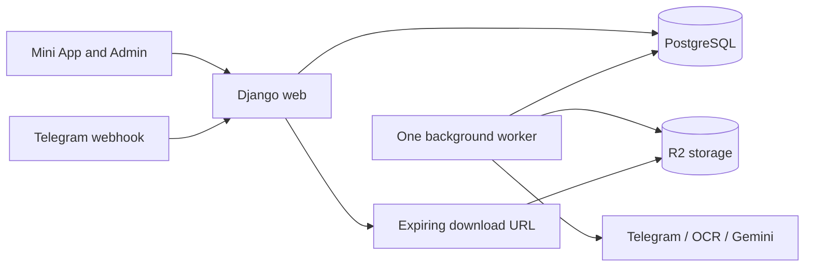

# UniPortal improvement roadmap

Created: 2026-10-08. Status: Phases 1–2 repository work verified; production checks pending.

## Product direction

UniPortal is currently in an adoption period. Students should be able to enjoy
the app for free while they build familiarity with it. Free access is an
intentional product decision, not a defect to fix by introducing paywalls.

This roadmap does **not** activate premium restrictions, enforce a five-question
daily allowance, or restrict existing student access. Paid-access enforcement
is deferred until the owner decides to monetize. Existing subscription records
and payment workflows should still remain accurate.

Free access does not remove the need for valid authentication, ownership checks
on personal records, input validation, or limits on request size and processing
time. Those controls protect availability without imposing paid quotas.

## Working principles

- Keep Django, PostgreSQL, Django Admin, and one codebase.
- Use clear feature modules and explicit functions. Avoid generic service,
  repository, and abstraction layers without a concrete need.
- Finish and verify one phase before moving to the next. Prefer small changes
  within each phase so failures are easy to identify and roll back.
- Preserve student workflows. Coordinate API response changes with the frontend.
- Measure server demand before changing worker counts or buying infrastructure.
- Reuse existing processing records before introducing new job models.
- Add tests for meaningful business rules and failure scenarios, not every
  reversible cleanup.
- Do not add microservices, Kubernetes, another database, or a separate queue
  service unless measured requirements justify them.

## Review baseline

The initial review covered the backend code, configuration, deployment files,
and tests. It did not inspect the frontend, live infrastructure, bucket
visibility, production traffic, backups, or bills.

Observed locally:

- 85 tests ran: 80 passed and five storage tests failed.
- Storage tests expect file copies, while the implementation shares a stored
  object between inbox and resource records.
- An invalid question limit (`limit=abc`) returns HTTP 500.
- A mixed quiz with a correct MCQ and a pending essay returns 100% at submission
  but displays 50% through the saved attempt model.
- Serializing three resources with prefetched courses still executes eight SQL
  queries.
- OCR installs signal handlers even though the extraction path runs in a
  background thread, where signal registration raises `ValueError`.
- Webhooks await file processing; exam processing uses a temporary daemon
  thread; AI extraction and broadcasts run inside admin requests.
- Downloads pass through Django, and resource serializers can also return
  direct storage URLs.

Premium-answer access and inconsistent free-question allowances were identified
in the review, but paid restrictions are intentionally excluded from the active
phases following the owner's clarification.

## Phase 1 — Establish a reliable baseline

**Outcome:** Tests reflect intended behavior, operational assumptions are known,
and later changes can be assessed against a repeatable baseline.

- [x] Reconcile the five failing storage tests with the intended shared-object
  approach. Preserve the benefit of avoiding unnecessary file copies.
- [x] Verify that clearing an inbox reference preserves a published resource's
  file, and that duplicate cleanup deletes only unreferenced duplicates.
- [x] Add CI for the test suite, Django system checks, and migration drift checks.
- [x] Run relevant database tests against PostgreSQL, especially transactions,
  concurrency, constraints, and JSON filtering. Keep SQLite convenient locally.
- [ ] Record the actual deployment: hosting provider, CPU/RAM, web worker count,
  database placement, storage configuration, scheduled commands, and monthly bill.
- [ ] Capture baseline request latency, error rate, peak memory/CPU, slow queries,
  file-transfer traffic, and processing backlog using available hosting tools.
- [ ] Verify the existing database/media backup arrangements and perform a restore
  into an isolated environment. Add missing backups if necessary.
- [x] Document the intentional free-access policy; identify existing route
  restrictions that conflict with it before any access-related implementation.

**Completion checks:** Intended storage behavior passes; checks are repeatable;
PostgreSQL validation is available; deployment and restore procedures are
documented. Measurements are recorded without claiming unverified cost savings.

Primary files: `apps/content/tests.py`, `apps/content/services.py`,
`apps/api/tests.py`, `README.md`, deployment configuration.

**2026-10-08 progress:** 92 tests pass on isolated PostgreSQL 18.6; SQLite passes
90 with two database-feature tests skipped. Shared-file cleanup protects other
resource/inbox references. PostgreSQL exposed and verified the fix for a command
closing its caller's transaction. System checks, migration drift, dependency
consistency, and a synthetic database/media restore pass. CI targets Python 3.12
and PostgreSQL 15; its hosted execution is pending. Railway Hobby is confirmed
by the owner, but actual usage, costs, schedules, and a real restore remain
unverified. See [Phase 1 baseline and operations](docs/PHASE_1_BASELINE.md).

## Phase 2 — Fix correctness and validate requests

**Outcome:** Valid requests produce consistent results; invalid requests return
clear client errors; payment actions do not leave partial state.

- [x] Add focused DRF input serializers for question selection, quiz submission,
  and subscription requests. Validate types, modes, IDs, answer shapes, duplicate
  question IDs, and bounded per-request limits.
- [x] Validate that submitted questions belong to the requested quiz context;
  reject unknown IDs and inconsistent course/paper associations. Keep access free.
- [x] For simulation, retain the issued question set so omitted answers count as
  unanswered rather than disappearing from the denominator. Prevent duplicate
  completion of the same attempt without building a general session framework.
- [x] Store a consistent gradable-question denominator and pending-question count.
  Use them across submission feedback, history, pass status, and performance.
  Decide explicitly how older attempts will be displayed or backfilled.
- [x] Calculate historical topic performance from stored answer snapshots rather
  than the current, potentially edited question bank.
- [x] Make subscription approval one explicit transactional operation. Lock the
  request and student, check state, and make repeated approval harmless.
- [x] Review rejection of previously approved payments, including renewals, so
  subscription expiry remains consistent with the agreed business rule.
- [x] Notify only after commit. In Phase 3, move notification delivery to the
  durable worker so Telegram failure cannot block or undo payment state.
- [x] Use atomic database expressions for download counters. Define them as link
  issuance counts unless actual completed transfers are measured.
- [x] Remove the hardcoded `Course(pk=1)` publishing dependency. Keep unassigned
  resources pending until an administrator selects their actual course.

**Completion checks:** Invalid inputs return 400 rather than 500; mixed-question
scores agree everywhere; simulation scoring includes unanswered questions;
concurrent/repeated approvals cannot activate twice; existing free access works.

Primary files: `apps/api/views.py`, `apps/api/serializers.py`,
`apps/quiz/engine.py`, `apps/quiz/models.py`, `apps/accounts/admin.py`,
`apps/accounts/models.py`, `apps/content/admin.py`.

**2026-10-08 progress:** Repository implementation verified. PostgreSQL passes
all 113 tests; SQLite passes 108 with five skipped. Coverage includes concurrent payment transitions, simulation completion,
and download increments. Input validation, historical scoring, and pending-only
rejection are covered. See [Phase 2 correctness](docs/PHASE_2_CORRECTNESS.md) for
API compatibility, migration and rollout details. Production/frontend checks
remain pending; notifications become durable in Phase 3.

## Phase 3 — Make background work durable

**Outcome:** Web requests remain short, and processing survives worker restarts
with controlled retries.

Start with one separate worker process using PostgreSQL-backed pending work.
Reuse `FileInbox` and `ExamPDFUpload` where appropriate. Add small durable records
for webhook acceptance and notification/AI work only where existing records
cannot represent the required lifecycle.

- [ ] Save and deduplicate accepted Telegram updates before returning success.
  Acknowledge only after persistence succeeds; do not discard failures to avoid
  retries.
- [ ] Move file download/extraction, exam PDF processing, AI extraction,
  broadcasts, and payment notifications out of web requests and daemon threads.
- [ ] Claim pending work atomically. Store claim time, retry count, next retry
  time, and the last error where needed.
- [ ] Recover only stale claims. Use bounded retries with backoff, and leave
  permanently invalid files visible for administrator review.
- [ ] Replace the current recovery-only `run_bot` deployment role with a clearly
  named worker command; keep one-off recovery commands explicit.
- [ ] Replace OCR signal alarms with supported subprocess/library timeouts.
  Bound page rendering, total processing time, and concurrent extraction.
- [ ] Report empty, skipped, and partially extracted documents accurately.
- [ ] Use unique temporary download paths, sanitize supplied filenames, and
  remove temporary files in `finally`.
- [ ] Handle Telegram rate limits and retry delivery failures. Persist broadcast
  progress so a restart does not resend every delivered message.
- [ ] Cache completed AI extraction by source content and extraction version;
  bound input/output size, validate generated questions, and avoid repeated paid
  extraction for identical inputs. Keep human review before publication.
- [ ] Schedule periodic commands explicitly and document their ownership.

**Completion checks:** Webhook acceptance is quick and durable; killing and
restarting the worker recovers unfinished work; duplicate updates do not create
duplicate content; OCR works in the chosen execution model; retries are bounded;
admin pages show useful progress and errors.

Primary files: `apps/api/views.py`, `apps/bot/application.py`,
`apps/bot/handlers.py`, `apps/bot/tasks.py`, `apps/bot/processor.py`,
`apps/bot/downloader.py`, `apps/bot/extractor.py`, `apps/exams/admin.py`,
`apps/exams/management/commands/process_exam_pdfs.py`,
`apps/accounts/notifications.py`, `Dockerfile`, `docker-compose.yml`, `Procfile`.

## Phase 4 — Reduce file-delivery and memory costs

**Outcome:** File transfers avoid consuming Django workers, and file handling
fits the available memory budget.

- [ ] Check actual R2 bucket visibility and the frontend's preview/download flow.
- [ ] Return short-lived R2 presigned URLs for downloads, allowing current free
  access under the adoption policy. Private storage is a delivery control, not
  permission to introduce a paywall.
- [ ] Replace permanent object URLs in serializers where the frontend needs a
  controlled preview/download URL; coordinate this before changing visibility.
- [ ] Preserve filenames, content types, link expiry handling, and browser CORS.
  Verify representative large files and mobile Telegram downloads.
- [ ] Retain a working local-development download path.
- [ ] Lower the in-memory upload threshold and add explicit size/type validation.
  The memory threshold itself is not a maximum permitted file size.
- [ ] Bound PDF page count/rendering and eliminate the unbounded all-page OCR
  fallback. Avoid treating a large digital PDF as necessarily expensive OCR.
- [ ] Move legacy duplicate-file cleanup into scheduled maintenance rather than
  running storage checks in the ingestion path.
- [ ] Define safe orphan cleanup and retention for temporary files, failed
  uploads, and obsolete extraction data. Protect every referenced stored object.
- [ ] Compare application bandwidth, memory, worker occupancy, and storage
  operations against the Phase 1 baseline.

**Completion checks:** Downloads work under the free-access policy; file bytes
flow directly from R2 in production; preview behavior remains usable; cleanup
preserves referenced files; measured server demand is recorded.

R2 presigned URLs use the S3 API endpoint and do not support custom domains
directly: [Cloudflare documentation](https://developers.cloudflare.com/r2/api/s3/presigned-urls/).

Primary files: `apps/api/views.py`, `apps/api/serializers.py`,
`apps/content/services.py`, `config/settings/base.py`,
`config/settings/docker.py`, `config/settings/prod.py`.

## Phase 5 — Make database and API work proportional to demand

**Outcome:** Common endpoints avoid repeated queries and unbounded object loads.

- [ ] Use prefetched course objects in resource serialization instead of
  `values_list()` queries on each resource.
- [ ] Load related courses, departments, and chapters with the relevant queries.
  Annotate question counts instead of recounting for each serialized object.
- [ ] Add explicit pagination to growing list endpoints. Coordinate response
  shape changes and incremental rollout with the frontend.
- [ ] Bound question-selection requests without imposing paid daily allowances.
  Filter in PostgreSQL and fetch only the selected full question records.
- [ ] Make selective practice use database filtering; keep chapter and topic
  semantics explicit before changing their representation.
- [ ] Aggregate performance in SQL and fetch only the required recent history.
  Avoid per-answer question lookups.
- [ ] Parse and validate exam imports before writing. Add domain uniqueness
  constraints, define correction/re-import behavior, and use bounded batch writes
  and transactions to prevent partial imports.
- [ ] Review slow queries with PostgreSQL query plans. Add justified indexes and
  remove redundant indexes, rather than indexing every field.
- [ ] Identify authenticated throttling by student ID. Review proxy/IP handling
  for anonymous endpoints and make multi-worker limits consistent where required.
  Operational throttles remain separate from monetization quotas.
- [ ] Cache small, frequently reused catalogue responses only if measurements
  justify it. Define invalidation before adding a cache service.

**Completion checks:** Query counts remain bounded as lists grow; list responses
and selections have explicit limits; import retries do not duplicate records;
performance latency improves against the baseline; PostgreSQL checks pass.

DRF throttles use cache-backed, non-atomic operations and are approximate; do not
use them as exact entitlement accounting:
[DRF documentation](https://www.django-rest-framework.org/api-guide/throttling/).

Primary files: `apps/api/views.py`, `apps/api/serializers.py`,
`apps/api/throttles.py`, `apps/quiz/engine.py`, `apps/exams/services.py`,
domain models and migrations.

## Phase 6 — Simplify code and production operation

**Outcome:** Responsibilities are easy to locate, deployment is predictable, and
the server is sized from evidence.

- [ ] Split the large API view file into feature modules while preserving URLs
  and response contracts. Keep views, serializers, and explicit domain functions
  easy to follow.
- [ ] Remove unreachable duplicated extraction code and caller-stack inspection.
  Payment authorization should be enforced by explicit code paths and state.
- [ ] Consolidate production settings while keeping local development convenient.
  Require production secrets, remove known fallback secrets, and verify secure
  cookies and trusted reverse-proxy settings against the actual deployment.
- [ ] Require the production webhook secret and restrict ingestion to configured
  source channels. Account for source chat IDs in deduplication if multiple
  channels are supported.
- [ ] Require valid Telegram authentication timestamps, reject excessive future
  timestamps, and review token lifetime with frontend reauthentication behavior.
- [ ] Run migrations once per release. Prepare static assets ahead of process
  startup where practical, and document rollback limitations for migrations.
- [ ] Configure database connection reuse consistently with worker concurrency.
  Add connection pooling only if measured connection pressure warrants it.
- [ ] Make health checks execute a small database query; expose worker backlog
  and stale-job status separately from web liveness.
- [ ] Add request/job identifiers and alerts for sustained API errors, worker
  failures, backlog growth, disk usage, and failed backups. Keep logs bounded and
  avoid logging tokens or unnecessary student/document content.
- [ ] Review dependency pins and remove packages only after checking usage.
  Keep security updates and supported versions deliberate.
- [ ] Tune Gunicorn worker count and background concurrency using realistic
  traffic and extraction workloads. Compare costs and latency with Phase 1.
- [ ] Update `README.md`, `PROJECT.md`, and `docs/ARCHITECTURE.md` to reflect the
  implemented deployment and remove obsolete descriptions.

**Completion checks:** Deployment checks pass with actual production settings;
restart/deploy and restore procedures work; code is simpler to navigate; latency,
resource usage, and cost comparisons are documented.

## Deferred — Monetization readiness

This section is inactive until the owner explicitly decides to introduce paid
access. Do not treat it as the next automatically authorized implementation phase.

- [ ] Agree on what remains free, what becomes paid, and how existing students
  transition. Document the product rules before changing endpoints.
- [ ] Enforce the agreed access policy consistently across question issuance,
  quiz submission, previews, downloads, and feedback.
- [ ] If daily allowances are introduced, track quiz usage separately from
  downloads and consume allowances atomically.
- [ ] Test free, paid, expired, inactive, and renewed account behavior, including
  attempts to bypass restrictions through alternative endpoints.
- [ ] Verify that permanent storage URLs cannot bypass the chosen access policy.
- [ ] Coordinate frontend messaging, migration, and rollout with the owner.

## Target architecture

One Django codebase with a web process, one background worker, PostgreSQL, and R2.
The web process handles authentication, validation, short database operations,
durable webhook acceptance, and download URL issuance. The worker handles slow
or retryable external work. Students download directly from storage.

## Tracking progress

For each phase, record the implementation date, changes, validation results,
measured impact, and remaining issues here. Check an item only after its behavior
has been verified. If a finding changes after production inspection, update the
roadmap rather than implementing an outdated assumption.

| Phase | Status | Validation / impact |
|---|---|---|
| 1 — Baseline | Repository work verified; production checks pending | 92 PostgreSQL tests; SQLite 90 passed / 2 skipped; synthetic restore passed. See docs/PHASE_1_BASELINE.md. |
| 2 — Correctness | Repository work verified; rollout pending | 113 PostgreSQL tests pass; SQLite 108 passed / 5 skipped; checks and synthetic restore recorded in docs/PHASE_2_CORRECTNESS.md. |
| 3 — Background processing | Not started | |
| 4 — File delivery | Not started | |
| 5 — Database and API efficiency | Not started | |
| 6 — Code and production operation | Not started | |
| Monetization readiness | Deferred by owner | Free adoption period |
